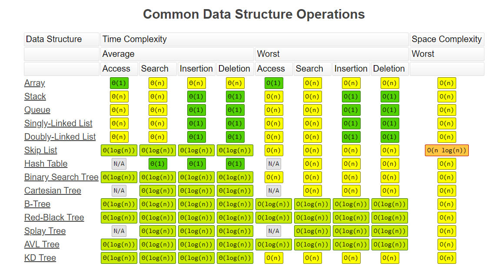
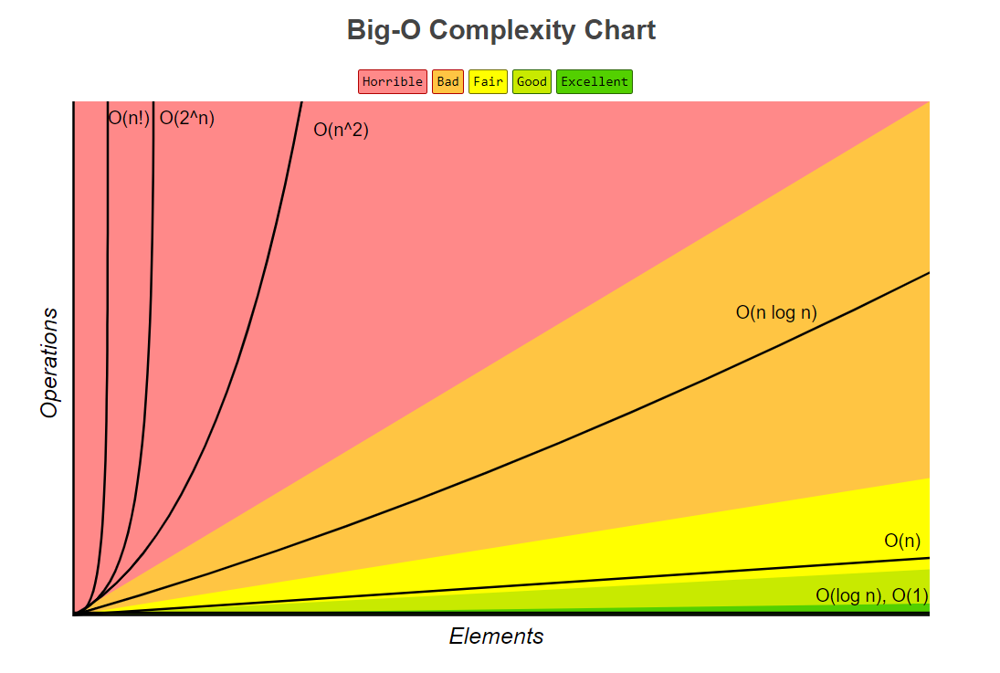
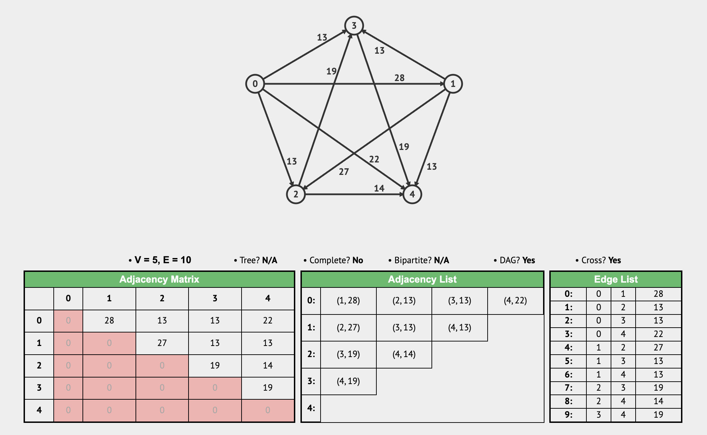

# Data Structures and Algorithms


***

## Introduction

* Data structure: memory for storing information

* Algorithm: method for solving a problem

  >Algorithms + Data Structures = Programs. By Niklaus Wirth.

* Not all problems can be solved, e.g. halting problem

* ```mermaid
  graph LR;
  Problem --> Idea
  Idea --> Algorithm
  Algorithm --> Program
  ```

* *My comprehension: data structure is the combination of the data which stores the value and the metadata which maintains the structure.*

* Basic operations on data structures

  * Accessing
  * Insertion
  * Deletion
  * Searching
  * Sorting
  * Traversal
  * 

* Pseudo code

  * Describe an algorithm

  * Should be abstract

    * Ignores unimportant details
    * Allows clear presentation of key idea
    * Simplifies analysis of a proposed solution

  * Templates

    ```markdown
    Algorithm
    Inputs
    Returns
    Variables (local)
    Begin
    
    End
    ```

    * Not rigid, different among various organizations

* All have **trade-offs**

***

## Big O

* Analyze an algorithm

  * Need to measure performance of different algorithms to allow us to compare them
  * Interested in efficiency of an algorithm
    * **Time**: how fast does an algorithm run
    * **Space**: how much memory is required **simultaneously**
  * Experimental approach: limited
  * Theoretical approach: Complexity analysis

* Big O Notation

  * Give an approximately **upper bound** on an algorithm complexity
  * `O(f(N))`: indicate the approximate number of **operations** required by an algorithm for input size `N`
  * 

  * Big O is a classification system that groups together algorithms that have similar performance. Enable us to quickly compare different algorithms
  * Extra effort to calculate exact bounds is normally unnecessary (is sometimes)
  * Two algorithms with same Big O performance may not behave exactly the same in practice
  * Big Omega Ω: lower bound on performance
  * Big Theta θ: bounded above and below

* Rules
  * Drop the non-dominant arithmetic terms

    * `O(f(N) + g(N)) = O(max(f(N), g(n)))`
    * `O(f(N)) * O(g(N)) = O(f(N) * g(N))`

  * Drop the constants

    * Adding, subtracting, multiplying, or dividing a Big O performance bound by a constant factor does not change it, doesn't matter how big the constant factor is

  * Different terms for multiple inputs

  * Functional call can cost more than `O(1)`

  * > Generally speaking, when you see an algorithm with multiple recursive calls, you're looking at exponential runtime

  * We can also approach the runtime by thinking about what the code is supposed to be doing

* Algorithm analysis case

  * Best case; Worst case; Average case (Don't constraint the input, still be infinity)
  * Normally focus on worst case as this gives us an upper bound
  * Average case can be useful but hard to calculate and assume random data
  * Best case seen as least useful but can provide a good indication of when to use a particular algorithm

***

## Data Structures

### Array

* Organizes items sequentially
* Sometimes called **list**
* Elements are stored in continuous memory, **accessing is `O(1)`**
* Array's index is actually a **pointer**
* Array can be empty, i.e. no elements, no memory allocated
* Static array and Dynamic array
  * Dynamic array allocate new memory and copy the old array
  * Append in static array is `O(1)`, in dynamic array is `O(n)`
* Pros
  * Fast lookup
  * Fast push / pop
  * Ordered
* Cons
  * Slow insertion
  * Slow deletion
  * Fixed size (static array)


***

### Linked List

* A linear collection of data elements, consisting of a group of nodes which together represent a sequence (**ordered**)
* Order is not given by elements' physical placement in memory
* Nodes have reference to adjacent nodes
* Head node, tail node
* `NULL` terminated
* **Sentinel nodes**
  * In some implementations an extra 'sentinel' or 'dummy' node may be added before the first data record or after the last one
  * This convention simplifies and accelerates some list-handling algorithms, by ensuring that all links can be safely dereferenced and that every list (even one that contains no data elements) always has a "first" and "last" node
* **Quick slow pointers**
  * Quick first move couple of steps, and then slow start to move too
  * Quick and slow move in different speed at the same time
  * Quick change the speed when some conditions are met

* Pros
  * Fast insertion
  * Fast deletion
  * Ordered
  * Flexible size
* Cons
  * Slow lookup
  * More memory
* Singly Linked List
  * 


* Doubly Linked List
  * 


* Single vs. Double
  * Single is a little faster, uses less memory
  * Double can be traversed from both directions

***

### Stack & Queue

* Stack

  * A list of objects

  * Three principle operations

    * **push**, which adds an element to the collection
    * **pop**, which removes the most recently added element that was not yet removed
    * **peek**, which accesses the top without modifying the stack

    > Limitation of functionalities is sometimes a better choice

  * **LIFO**

* Queue

  * A list of object
  * Four principle operations
    * **enqueue**, which adds an element to the rear terminal position
    * **dequeue**, which removes the element from the front terminal position
    * **front**, which accesses the front item from the queue
    * **rear**, which accesses the last item from the queue
  * **FIFO**

* Both can be implemented by *Array* or *Linked list*, each way has pros and cons

* Pros

  * Fast operations
  * Limited operations
  * Ordered

* Cons

  * Slow lookup

***

### Hash Table

* Also called **Hash Map**, **Dictionary**

* A data structure which can **map keys to values**. A hash table uses a **hash function** to compute an index into an array of buckets or slots, from which the desired value can be found

* Key has to be unique, value can be the same

* Basic idea: **Perfect hashing**

  * Suppose key values within range `0` to `N-1` and use an array of size `N` to store records
  * Then a key can correspond directly to the array location of its associated record
  * Searching and insertion would require only a single array access and thus `O(1)`
  * However, perfect hashing is rarely practical to implement

* Hash function

  * **One-way** function

  * Idempotent

  * ```mermaid
    graph LR;
    K((Key)) --> H[Hash Function]
    H --> L((location))
    ```

  * Two important issues in Hashing (**防，治思想**)

    * How to define a good hash function?
      * Need to ensure hash function is reasonably random, which means key will be evenly distributed and so reduces key collisions
    * How to resolve key collisions?

* Collision resolution strategies

  * **Separate Chaining**
    
    * Build a linked list for each of the table position
    
  * **Linear Probing**

    * No linked list, just array

    * When a key collides with a previously inserted key we simply place it in the next available unused location to the right (if reaching the end go the beginning)

      > There is possibly a key collision in a sequential non-null elements between `null` and `null`

    * Searching

      * Find the position using hash function
      * Search from here upwards through array looking for key
      * Searching is deemed **unsuccessful if we reach an empty location or end up back where we started**

    * Deletion

      * Cannot directly delete the element (new `null` may affect searching)
      * Two possible approaches
        * Using a special **Ilinking** (empty character) to **mark a deletion** - searching does not stop if this character is encountered
          * Simple but can be slow for searching
        * **Delete the contiguous occupied cells to the right and reinsert them**
          * More costly but faster searching

* Pros

  * Fast operations: search, insertion, deletion take `O(1)` on average
  * Flexible keys: most data types can be used for keys, as long as they're hashable

* Cons

  * Slow worst case: operations take `O(N)` in the worst case
  * **Unordered**: keys are not stored in a special order
  * Single-directional lookups: look up the value for a given key is `O(1)`, but look up the key for a given value is `O(N)`
  * Not cache-friendly: usage of linked list with separate chaining solution

* Performance of hash map

  * **Initial Capacity**
    * It is the capacity of HashMap at the time of its creation (It is the number of buckets a HashMap can hold when the HashMap is instantiated)

  * **Load Factor**
    * It is the percent value of the capacity after which the capacity of HashMap is to be increased (It is the percentage fill of buckets after which Rehashing takes place)

  * Threshold
    * Load Factor × Initial Capacity

  * Rehashing
    * It is the process of **doubling** the capacity of the HashMap after it reaches its Threshold

  * If the initial capacity is kept higher then rehashing will never be done. But by keeping it higher increases the time complexity of iteration. So it should be chosen very cleverly to increase performance. The expected number of values should be taken into account to set the initial capacity. The most generally preferred load factor value is **0.75** which provides a good deal between time and space costs. The load factor’s value varies between 0 and 1.

* When Hash Map operations cost `O(N)` time?

  * Hash collisions
    * If all our keys caused hash collisions, we'd be at risk of having to walk through all of our values for a single lookup (one big linked list). This is unlikely, but it could happen

  * Dynamic array resizing
    * Suppose we keep adding more items to our hash map. As the number of keys and values in our hash map exceeds the number of indices in the underlying array, hash collisions become inevitable. To mitigate this, we could expand our underlying array whenever things start to get crowded. That requires allocating a larger array and rehashing all of our existing keys to figure out their new position—O(n) time.


***

### Tree

#### Binary Tree

* Tree is a data structure where the data is organized in a hierarchical structure. There should be one **root node** (which does not have any parent) and all subsequent nodes are represented as children of the root node and its children

* If a node has at least one child, it is called **internal node** and **nodes with no children** are called **leaf nodes**

* **Perfect binary tree**: every node except leaf nodes has exactly two child nodes, all leaf nodes are at the same level

* **Full binary tree**: every node except leaf nodes has zero or two child nodes

* **Complete binary tree**: a binary tree in which every level, except possibly the last, is completely filled, and all nodes in the last level are as far left as possible

* **Balanced Binary Tree**: The heights of any node’s left and right subtrees differ by at most one

* 

* Implementation

  * **Tree node**

  * **Array** for complete binary tree

  * **Program stack**
  
  * **Hash table**

* Traversal

  * **DFS**

    * **Three different orders represents three different times when the specific operation is operating on the node**

      * **Pre-order**: operates when the procedure call of current node is just pushed onto the stack
      * **In-order**: operates when the left subtree's operation is executed and the right subtree's operation is about to executed
      * **Post-order**: operates when the the procedure call of current node is about to be popped out from the stack

    * ```java
      void traverseDFS(TreeNode root) {
          if (root == null) {
              return;
          }
          // preorder
          traverse(root.left);
          // inorder
          traverse(root.right);
          // postorder
      }
      			  1
          2    	  3
        4   5   6   7
      
      // Example: 	[1,2,3,4,5,6,7]
      // preorder: 	[1,2,4,5,3,6,7]
      // inorder:		[4,2,5,1,6,3,7]
      // postorder:	[4,5,2,6,7,3,1]
      ```

  * BFS

    * ```java
      void traverseBFS(TreeNode root) {
          if (root == null)
              return;
        
          Deque<TreeNode> q = new ArrayDeque<>();
          q.add(root);
          int depth = 1;
          while (!q.isEmpty()) {
              int sz = q.size();
              for (int i = 0; i < sz; i++) {
                  TreeNode cur = q.remove();
                  System.out.println("depth = " + depth + ", val = " + cur.val);
                  if (cur.left != null) 
                      q.add(cur.left);
                  if (cur.right != null)
                      q.add(cur.right);
              }
              depth++;
          }
      }
      ```


#### Binary Search Tree

* A binary tree that **`left.val < root.val < right.val`**

* For each node in a BST, **its left subtree and right subtree are BST**

* Searching, insertion, deletion - `O(log N)` for balanced BST, `O(N)` for unbalanced BST
  * For a perfect binary tree, its level is equal to `log (N + 1)`, which is approximately `log N`

  * ```markdown
    Algorithm 	findBST
    Inputs			c: Pointer; key: Integer
    Returns 		Pointer
    
    Begin
    	if c = NULL then return NULL
    	else
    		if c.key() = key then return c
    		if c.key() > key then
    			return findBST(c.leftPTR(), key)
        else
        	return findBST(c.rightPTR(), key)
    End
    
    c - pointer to current node
    c.key() - value at node c
    c.leftPTR() - pointer to left node at c
    ```

* Deletion
  * Node with at most one subtree
    * Simple delete and change the pointer if needed
  * Root node & nodes that have two subtrees
    * Marked as deleted, or
    * **Minimum in right subtree**, or
      * Find next highest node N, i.e., go right then left as far as you can
      * Delete N (having at most one subtree)
      * Replace node deleting by node N
    * **Maximum in left subtree**

#### AVL Tree

* A self-balancing BST

#### Red-Black Tree

* A self-balancing BST

***

### Binary Heap

***

### Priority Queue

***

### Trie

***

### Graph

#### Graph

* A graph consists of a collection of objects (**vertex**) and connections between them (**edge**)

* A superset of non-binary tree

* Types

  * Directed graph
  * Undirected graph
    * Is technically a **dual-directed graph**
  * Weighted graph
  * Unweighted graph
  * Cyclic graph
  * Acyclic graph

* **Degree**

  * How many edges does a vertex have
  * Indegree and outdegree for a directed graph

* **Simple graph**

  * Graphs without **self loop** or **parallel edges**
  * **$E = [0, V*(V - 1) / 2] \approx [0, V^2]$ **
  * [**Sparse graph** -> **Dense graph**]

* Subgraph

  * **Spanning subgraph**
    * A subgraph which contains **all vertices and some edges**

  * **Induced subgraph**
    * A subgraph which contains **some vertices and all edges connecting them**

* Connectivity

  * **Connected graph**
    * If there is **a path** between any pair of vertices in an **undirected graph**, it is a connected graph

  * **Strongly Connected Graph**
    * If there is **a directed path** between any pair of vertices in a **directed graph**, it is a strongly connected graph

  * **Weakly Connected Graph**
    * If there is **a path** between any pair of vertices in a **directed graph after turning into an undirected graph**, it is a weakly connected graph

* Implementations

  * **Edge list**

  * **Adjacent list**
    * Vertices are stored as records or objects, and every vertex stores a list of adjacent vertices

  * **Adjacent matrix**
    * A two-dimensional matrix, in which the rows represent source vertices and columns represent destination vertices
    * Data on edges and vertices must be stored externally. Only the cost for one edge can be stored between each pair of vertices

  * **Incidence matrix**
    * A two-dimensional matrix, in which the rows represent the vertices and columns represent the edges
    * The entries indicate the incidence relation between the vertex at a row and edge at a column

  * Examples

    * Undirected and unweighted
      * 
    * Directed and weighted
      * 

* **Complexity**

  * |                                                              |                        Adjacency list                        |                       Adjacency matrix                       |                       Incidence matrix                       |
    | :----------------------------------------------------------- | :----------------------------------------------------------: | :----------------------------------------------------------: | :----------------------------------------------------------: |
    | Store graph                                                  |                         $O(|V|+|E|)$                         |                          $O(|V|^2)$                          |                        O(\|V\|⋅\|E\|)                        |
    | Add vertex                                                   |                            $O(1)$                            |                          $O(|V|^2)$                          |                        O(\|V\|⋅\|E\|)                        |
    | Add edge                                                     |                            $O(1)$                            |                            $O(1)$                            |                        O(\|V\|⋅\|E\|)                        |
    | Remove vertex                                                |                           $O(|E|)$                           |                          $O(|V|^2)$                          |                        O(\|V\|⋅\|E\|)                        |
    | Remove edge                                                  |                           $O(|V|)$                           |                            $O(1)$                            |                        O(\|V\|⋅\|E\|)                        |
    | Are vertices *x* and *y* adjacent (assuming that their storage positions are known)? |                           $O(|V|)$                           |                            $O(1)$                            |                           O(\|E\|)                           |
    | Remarks                                                      | Slow to remove vertices and edges, because it needs to find all vertices or edges | Slow to add or remove vertices, because matrix must be resized/copied | Slow to add or remove vertices and edges, because matrix must be resized/copied |

    **Adjacency lists** are generally preferred for **sparse graphs**, while an **adjacency matrix** is preferred for **dense graphs**


  * Adjacency matrix can leverage matrix operations to solve some subtle problems

  * **The time complexity of operations in the adjacency list** representation can be improved by storing the sets of **adjacent vertices** in more efficient data structures, such as **hash tables** or **balanced BST**

* Traversal

  * **DFS**

    * ```java
      // 遍历所有节点
      // O(E + V)
      
      // in case there is a cycle in the graph that causes dead loop
      void traverse(Graph graph, int s, boolean[] visited) {
          // base case
          if (s < 0 || s >= graph.size()) {
              return;
          }
          if (visited[s]) {
              // 防止死循环
              return;
          }
          // 前序位置
          visited[s] = true;
          System.out.println("visit " + s);
          for (Edge e : graph.neighbors(s)) {
              traverse(graph, e.to, visited);
          }
          // 后序位置
      }
      ```

    * ```java
      // 遍历所有边
      // O(E + V^2)
      
      void traverseEdges(Graph graph, int s, boolean[][] visited) {
          // base case
          if (s < 0 || s >= graph.size()) {
              return;
          }
          for (Edge e : graph.neighbors(s)) {
            // 如果边已经被遍历过，则跳过
            if (visited[s][e.to]) {
              continue;
            }
            // 标记并访问边
            visited[s][e.to] = true;
            System.out.println("visit edge: " + s + " -> " + e.to);
            traverseEdges(graph, e.to, visited);
          }
      }
      ```

    * ```java
      // 遍历图的所有路径，寻找从 src 到 dest 的所有路径
      
      // onPath 和 path 记录当前递归路径上的节点
      boolean[] onPath = new boolean[graph.size()];
      List<Integer> path = new LinkedList<>();
      
      void traverse(Graph graph, int src, int dest) {
          // base case
          if (src < 0 || src >= graph.size()) {
              return;
          }
          if (onPath[src]) {
              // 防止死循环（成环）
              return;
          }
          if (src == dest) {
              // 找到目标节点
              System.out.println("find path: " + String.join("->", path) + "->" + dest);
              return;
          }
      
          // 前序位置
          onPath[src] = true;
          path.add(src);
          for (Edge e : graph.neighbors(src)) {
              traverse(graph, e.to, dest);
          }
          // 后序位置
          path.remove(path.size() - 1);
          onPath[src] = false;
      }
      
      // 因为前文遍历节点的代码中，visited 数组的职责是保证每个节点只会被访问一次。而对于图结构来说，要想遍历所有路径，可能会多次访问同一个节点，这是关键的区别。
      ```

    * **同时使用`visited` and `onPath`**

      * 遍历所有路径的算法复杂度较高，大部分情况下我们可能并不需要穷举完所有路径，而是仅需要找到某一条符合条件的路径。这种场景下，我们可能会借助 `visited` 数组进行剪枝，提前排除一些不符合条件的路径，从而降低复杂度。

    * **不使用`visited` and `onPath`**

      * Acyclic graph

  * **BFS**

    * ```java
      // 从 s 开始 BFS 遍历图的所有节点，且记录遍历的步数
      void bfs(Graph graph, int s) {
          boolean[] visited = new boolean[graph.size()]; 
          Queue<Integer> q = new LinkedList<>();
          q.offer(s);
          visited[s] = true; 
          // 记录从 s 开始走到当前节点的步数
          int step = 0;
          while (!q.isEmpty()) {
              int sz = q.size();
              for (int i = 0; i < sz; i++) {
                  int cur = q.poll();
                  System.out.println("visit " + cur + " at step " + step);
                  for (Edge e : graph.neighbors(cur)) {
                      if (visited[e.to]) { 
                          continue;
                      }
                      q.offer(e.to);
                      visited[e.to] = true;
                  }
              }
              step++;
          }
      }
      ```

#### Eulerian Graph

* Origin from the famous **Seven Bridges of Königsberg**

* **Eulerian Path**: 在图中找到一条路径，使得每条边都被遍历恰好一次的路径

* **Eulerian Circuit**: 欧拉路径的特殊情况，即起点和终点是同一个节点的欧拉路径

* **欧拉图（Eulerian Graph）**：存在欧拉回路的图

* **半欧拉图（Semi-Eulerian Graph）**：存在欧拉路径但不存在欧拉回路的图

* **非欧拉图（Non-Eulerian Graph）**：既不存在欧拉路径也不存在欧拉回路的图

* Pattern

  * **Undirected graph**
    * 欧拉图（存在欧拉回路）的充要条件是 **所有节点的度数都是偶数**。
    * 半欧拉图（存在欧拉路径）的充要条件是 **有且仅有两个节点的度数为奇数**。
  * **Directed graph**
    * 欧拉图（存在欧拉回路）的充要条件是 **每个节点的入度等于出度**。
    * 半欧拉图（存在欧拉路径）的充要条件是 **有一个节点出度比入度多 1，有一个节点入度比出度多 1，其余节点入度等于出度**。

* Algorithm

  * ```java
    // Time complexity: O(E + V), because we delete the accessed edge, instead of using boolean[][] visited
    
    class HierholzerAlgorithm {
    
        // 计算欧拉路径/回路，不存在则返回 null
        public static List<Integer> findEulerianPath(Graph graph) {
            // 1. 根据度数确定起点
            int start = findStartNode(graph);
            if (start == -1) {
                // 不存在欧拉路径/回路
                return null;
            }
            
            // 2. 从起点开始执行 DFS 算法，记录后序遍历结果
            List<Integer> postOrder = new ArrayList<>();
            traverse(graph, start, postOrder);
            
            // 3. 反转后序遍历结果，即可得到欧拉路径/回路
            Collections.reverse(postOrder);
            return postOrder;
        }
    
        // 图结构的 DFS 遍历函数
        private static void traverse(Graph graph, int u, List<Integer> postOrder) {
            // base case
            if (u < 0 || u >= graph.size()) {
                return;
            }
    
            while (!graph.neighbors(u).isEmpty()) {
                Edge edge = graph.neighbors(u).get(0);
                int v = edge.to;
                // 直接删掉边，避免重复遍历
                graph.removeEdge(u, v);
                traverse(graph, v, postOrder);
            }
    
            // 后序位置，记录后序遍历结果
            postOrder.add(u);
        }
    
        // 根据度数确定起点，如果不存在欧拉路径，返回 -1
        // 有向图和无向图的代码实现不同
        private static int findStartNode(Graph graph) {
            // ...
        }
    }
    ```

  * ```java
    // 无向图的 findStartNode 函数实现
    private static int findStartNode(Graph graph) {
        int start = 0;
        // 记录奇数度节点的数量
        int oddDegreeCount = 0;
        for (int i = 0; i < graph.size(); i++) {
            if (graph.neighbors(i).size() % 2 == 1) {
                oddDegreeCount++;
                start = i;
            }
        }
        // 如果奇数度节点的数量不是 0 或 2，则不存在欧拉路径
        if (oddDegreeCount != 0 && oddDegreeCount != 2) {
            return -1;
        }
        // 如果奇数度节点的数量是 0，则任意节点都可以作为起点，此时 start=0
        // 如果奇数度节点的数量是 2，任意一个奇数度节点作为起点，此时 start 就是奇数度节点
        return start;
    }
    ```

  * ```java
    // 有向图的 findStartNode 函数实现
    private static int findStartNode(Graph graph) {
        // 记录每个节点的入度和出度
        int[] inDegree = new int[graph.size()];
        int[] outDegree = new int[graph.size()];
        for (int i = 0; i < graph.size(); i++) {
            for (Edge edge : graph.neighbors(i)) {
                inDegree[edge.to]++;
                outDegree[i]++;
            }
        }
        // 如果每个节点的入度出度都相同，则存在欧拉回路，任意节点都可以作为起点
        boolean allSame = true;
        for (int i = 0; i < graph.size(); i++) {
            if (inDegree[i] != outDegree[i]) {
                allSame = false;
                break;
            }
        }
        if (allSame) {
            // 任意节点都可以作为起点，就让我们以 0 作为起点吧
            return 0;
        }
    
        // 现在寻找是否存在节点 x 和 y 满足：
        // inDegree[x] - outDegree[x] = 1 && inDegree[y] - outDegree[y] = -1
        // 且其他节点的入度和出度都相等
        // 如果存在，则 x 是起点，y 是终点
        int x = -1, y = -1;
        for (int i = 0; i < graph.size(); i++) {
            int delta = inDegree[i] - outDegree[i];
            if (delta == 0) {
                continue;
            }
            if (delta != 1 && delta != -1) {
                // 不存在欧拉路径
                return -1;
            }
            if (delta == 1 && x == -1) {
                x = i;
            } else if (delta == -1 && y == -1) {
                y = i;
            } else {
                // 不存在欧拉路径
                return -1;
            }
        }
    
        if (x != -1 && y != -1) {
            // 存在欧拉路径，x 是起点
            return x;
        }
    
        return -1;
    }
    ```

  * [**Postorder correctiveness analysis**](https://labuladong.online/algo/data-structure/eulerian-graph-hierholzer/#%E6%AD%A3%E7%A1%AE%E6%80%A7%E5%88%86%E6%9E%90-%E5%8F%AF%E9%80%89)

#### Dijkstra algorithm

* Find the shortest path in a non-negative weighted graph
* A bit more efficient than Bellman-Ford

#### Bellman-Ford algorithm

* Find the shortest path in a weighted graph

***

## Algorithms

### Recursion

* A function being defined is applied within its own definition
* Stack overflow: keep invoking function without end condition until too much memory is used on the call stack
* Base case & Recursive case
* Anything done with a recursion **CAN** be done iteratively
* Divide and Conquer

***

### Sorting

* Comparison sort and non-comparison sort
* Comparison sort cannot really beat O(N*logN)

#### Bubble Sort

* Find the biggest element in the unsorted array and bubble it up to the end

  * unsorted + sorted

* ```markdown
  Algorithm 	bubbleSort
  Inputs			A: Array of Integers
  Variables		n, i: Integer; swapped: Boolean
  
  Begin
  	n := size(A)
  	do
  		swapped := false
  		for i := 1 to n - 1 do
  			if A[i - 1] > A[i] then 
  				swap(A[i-1], A[i])
  				swapped := true
      n := n - 1
  	while not swapped
  End
  ```

* Only for educational purpose

* Performance

  * Best case: O(N) for a sorted array
  * Worst case: O(N^2^)
  * Average case: O(N^2^)
  * Space: O(1)

#### Selection Sort

* Scan and select the smallest element in the unsorted array and swap it with the leftmost unsorted element

  * sorted + unsorted

* ```markdown
  Algorithm		selectionSort
  Inputs			A: Array of Integers
  Variables		i, j, smallest: Integers
  
  Begin
  	for i := 0 to size(A) - 1 do
  		smallest := i
  		for j:= i + 1 to size(A) - 1 do
  			if A[j] < A[i] then
  				smallest = j
      swap(A[i], A[smallest])
  End
  ```

* Only for educational purpose
* Performance
  * O(N^2^)
  * Space: O(1)

#### Insertion Sort

* Consider one element at a time and insert it into its correct positiion in the sorted array

  * sorted + unsorted

* ```markdown
  Algorithm 	insertionSort
  Inputs			A: Array of Integers
  Variables		i, j, key: Integers
  
  Begin
  	for i:= 1 to size(A) - 1 do
  		key := A[i]
  		j := i
  		while j > 0 and key < A[j - 1] do
  			A[j] := A[j - 1]
  			j := j - 1
      A[j] := key
  End
  ```

* Works well for small array (typically between 7 and 50 elements) or nearly sorted array

* Performance

  * Best case: O(N) for a sorted array
  * Worst case: O(N^2^)
  * Average case: O(N^2^)
  * Space: O(1)

* Refinement

  * Add a sentinel element make it the smallest
  * So that the comparison `j > 0` can be omitted in the beginning of the loop

#### Merge Sort

* Idea

  * Divide the unsorted list into *n* sublists, each containing one element (a list of one element is considered sorted)
  * Repeatedly merge sublists to produce new sorted sublists until there is only one sublist remaining. This will be the sorted list

* ```markdown
  Algorithm		mergeSort
  Inputs			A: Array of Integers
  Variables		i: Integer; left, right: Array of Integers
  
  Begin
  	if size(A) <= 1 then	return A
  	
  	left := empty array
  	right := empty array
  	for i:= 0 to size(A) - 1 do
    	if i < size(A) / 2 then
    		left.add(A[i])
      else
      	right.add(A[i])
    
    left := mergeSort(left)
    right := mergeSort(right)
    
    return merge(left, right)  
  End
  ```

* ```markdown
  Algorithm		merge
  Inputs			left, right: Array of Integers
  Variables		result: Array of Integers
  
  Begin
  	result := empty list
  
  	while left is not empty and right is not empty do
      if first(left) ≤ first(right) then
      	append first(left) to result
        left := rest(left)
      else
        append first(right) to result
        right := rest(right)
        
  	while left is not empty do
        append first(left) to result
        left := rest(left)
  	while right is not empty do
        append first(right) to result
        right := rest(right)
  	return result
  End
  ```

* Overall great but requires more space, stable sort

* Performance

  * O(N*logN)
  * Space: O(N)

#### Quick Sort

* Idea

  * Choose rightmost value in the array as pivot v
  * Rearrange (partition) the array so that v is in its correct place, i.e.
    * Every element to left is smaller than v
    * Every element to right is larger than v
  * Recursively apply above to left hand side and right hand side of the array
  * When a partition contains only one element then the recursion ends

* ```markdown
  Algorithm 	quickSort
  Inputs			A: Array of Integers
  Variables		p: Integer
  
  Begin
  	if (R > L) then
  		p := partition(A, L, R)
  		quickSort(A, L, p - 1)
  		quickSort(A, p + 1, R)
  End
  
  p - index of the pivot in the correct place
  ```

* ```markdown
  Algorithm 	partition
  Inputs			A: Array of Integers; L, R: Integer
  Variables		pL, pR, v: Integer
  Return			Integer
  
  Begin
  	v := A[R]
  	pL := L; pR := R
  	while pL < pR do
  		while A[pL] < v do 
  			pL := pL + 1
  		while A[pR] >= v and pR > L do
  			pR := pR - 1
      if pL < pR then
      	swap(A[pL], A[pR])
  	swap(A[pL], A[R])
  	return pL
  End
  ```

* Practically faster than Merge Sort and Heap Sort, in-place sort

* Performance

  * Best case, Average case: O(N*logN)
  * Worst case: O(N^2^)
    * Occurs when the partition size are as uneven as possible
    * Bad choice of pivot
    * Sorted array when the last element is chosed as pivot
  * Space: O(logN)

* Refinement

  * Smarter choice of pivot

  * Leaves array nearly sorted and then complete sorting using Insertion Sort efficiently

  * ```markdown
    Begin
    	if (R - L > few) then
    		p := partition(A, L, R)
    		quickSort(A, L, p - 1)
    		quickSort(A, p + 1, R)
    End
    ```

  * Experimentation suggests `few` is between 5 and 25

#### Heap Sort


#### Counting Sort

* Integer sorting algorithm
* Works best when the range of numbers for each array element is very small

#### Radix Sort

* Integer sorting algorithm

#### Bucket Sort

***

### Searching

* Fundamental task needed in most computing systems

#### Sequential Search

#### Binary Search

* Divide and conquer

* Works on a sorted array

* ```markdown
  Algorithm 	binarySearch
  Inputs			A: Array of Integers; key: Integer; L, R: Integer
  Variables		m: Integer
  Return			Integer
  
  Begin
  	if R < L then return -1
  	m := (R + L) / 2
  	if key = A[m] then return m
  	else if key > A[m] then
  		return binarySearch(A, key, m + 1, R)
  	else
    	return binarySearch(A, key, l, m - 1)
  End
  ```

* Performance

  * Best case: O(1)
  * Worst case: O(logN)

***

### Greedy

* A greedy algorithm is a problem-solving technique that makes the best local choice at each step in the hope of finding the global optimum solution

***

### Dynamic Programming


***

## Resource

* [Big O Cheat Sheet](https://www.bigocheatsheet.com/)
* <https://github.com/trekhleb/javascript-algorithms>
* <https://github.com/TheAlgorithms/Java>
